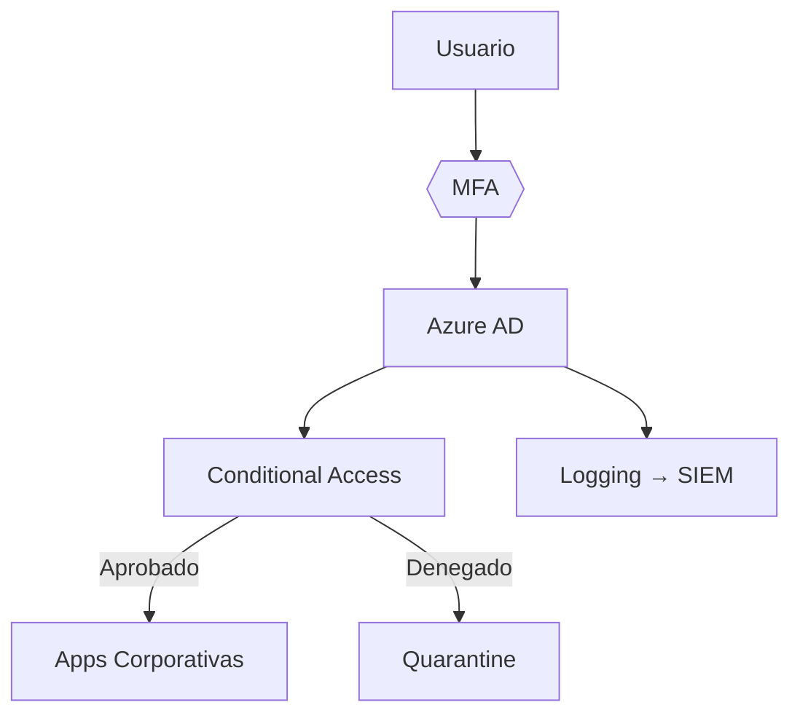

# 🛡️ Challenge IAM GOV - KIMBERLY.SAS  
**Estrategia de Seguridad Adaptativa con Zero Trust**  

<div align="center">
  
  
  
</div>

---

## 📌 Pilares Fundamentales  
| Pilar | Tecnologías Clave | Beneficios |  
|-------|------------------|------------|  
| **Centralización** | Azure AD / Okta | Gestión unificada de identidades |  
| **Zero Trust** | MFA + Conditional Access | Verificación contextual |  
| **Automatización** | Terraform + Playbooks | Reducción de errores humanos |  
| **Seguridad Adaptativa** | Trend Micro XDR + SIEM | Protección dinámica |  

---

## 🏗️ Arquitectura Propuesta  

🔐 Componentes Clave
1. Conexión entre Sedes
+ ZTNA: Cloudflare Warp / Palo Alto GlobalProtect
+ VPN: FortiClient con autenticación certificada
+ SSO: SAML 2.0 / OpenID Connect

2. Gestión de Dispositivos 
+ Microsoft Intune (Windows)  
+ Mosyle (Apple)  
+ Google MDM (Android)
  
3. Privileged Access
+ Azure PIM para acceso JIT
+ Auditorías trimestrales automatizadas
+ Cuentas administrativas segregadas

## 💼 Integración con P@yroll - Seguridad Garantizada

<div align="center">
  
  
</div>

### 🔗 Componentes de Integración
```mermaid
flowchart LR
    A[P@yroll] -->|SAML 2.0| B[Azure AD]
    B --> C{{Conditional Access}}
    C -->|Aprobado| D[Acceso a Datos]
    C -->|Denegado| E[Bloqueo]
    A --> F[Logging → XDR]
```

🛡️ Estructura de Controles
Capa	Tecnología	Implementación
Autenticación	Azure AD + SSO	Federación con OpenID Connect
Autorización	RBAC + ABAC	Roles predefinidos (HR_Admin, HR_ReadOnly)
Monitoreo	Trend Micro XDR	Alertas por:
- Accesos fuera de horario
- Descargas masivas
Auditoría	Azure Access Reviews	Revisiones automáticas mensuales

📋 Checklist de Implementación
+ [x] Configurar SSO con certificados TLS 1.3
+ [x] Sincronizar grupos de Azure AD con roles P@yroll
! [ ] Implementar políticas DLP para datos sensibles (En progreso)
- [ ] Automatizar reportes de cumplimiento (Q3 2023)

<div align="center" style="margin-top: 40px; border-top: 1px solid #e1e4e8; padding-top: 20px;"> <strong>✨ "La seguridad no es un producto, sino un proceso continuo"</strong> <p>Propuesta técnica desarrollada por [Cristian Barragán]</p> <sub>📅 Actualizado: {01/04/2025} | 🔗 [Documentación Completa](https://github.com/SrCris49/Challenges-MELI/blob/master/Kimberly%20SAS/Propuesta%20de%20proyecto.pdf)</sub> </div>
