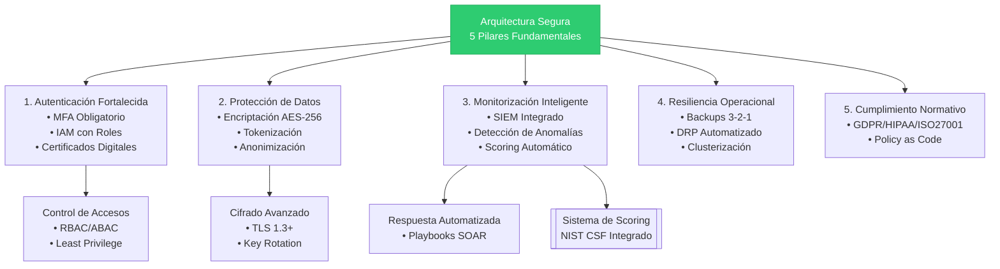

```mermaid
flowchart TD
    A[Arquitectura Segura\n5 Pilares Fundamentales]
    
    %% Pilares principales
    B[1. Autenticación Fortalecida\n• MFA Obligatorio\n• IAM con Roles\n• Certificados Digitales]
    C[2. Protección de Datos\n• Encriptación AES-256\n• Tokenización\n• Anonimización]
    D[3. Monitorización Inteligente\n• SIEM Integrado\n• Detección de Anomalías\n• Scoring Automático]
    E[4. Resiliencia Operacional\n• Backups 3-2-1\n• DRP Automatizado\n• Clusterización]
    F[5. Cumplimiento Normativo\n• GDPR/HIPAA/ISO27001\n• Policy as Code]
    
    %% Subsistemas
    G[Control de Accesos\n• RBAC/ABAC\n• Least Privilege]
    H[Cifrado Avanzado\n• TLS 1.3+\n• Key Rotation]
    I[Respuesta Automatizada\n• Playbooks SOAR]
    J[[Sistema de Scoring\nNIST CSF Integrado]]
    
    %% Conexiones
    A --> B & C & D & E & F
    B --> G
    C --> H
    D --> I & J
    
    %% Estilos compatibles con GitHub
    classDef main fill:#2ecc71,stroke:#27ae60,color:white
    class A main
    class J fill:#e74c3c,stroke:#c0392b,color:white
```
